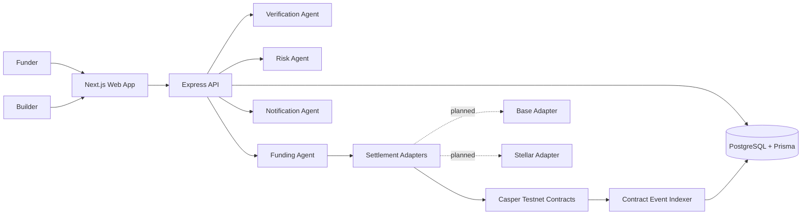

# Architecture



The MVP optimizes for one complete path while keeping the protocol structure chain-ready. The frontend presents the grant lifecycle; the API owns state, AI orchestration, settlement adapter calls, and transaction history. Casper is the live reference adapter today. Base and Stellar directories are reserved for future settlement implementations.

## Repository Layout

```text
apps/
  web/                    Next.js application
  api/                    Express API, agents, indexer-style state
    src/chains/           Backend settlement adapters
chains/
  casper/                 Live Casper reference implementation
    contracts/grant-escrow/
  base/                   Planned EVM adapter
  stellar/                Planned Stellar adapter
```
