# Architecture

```mermaid
flowchart LR
  Funder[Funder] --> Web[Next.js Web App]
  Builder[Builder] --> Web
  Web --> API[Express API]
  API --> DB[(PostgreSQL + Prisma)]
  API --> Verify[Verification Agent]
  API --> Risk[Risk Agent]
  API --> Funding[Funding Agent]
  Funding --> Casper[Casper Testnet Contracts]
  API --> Notify[Notification Agent]
  Casper --> Indexer[Contract Event Indexer]
  Indexer --> DB
```

The MVP optimizes for one complete path. The frontend presents the grant lifecycle; the API owns state, AI orchestration, Casper transaction submission, and transaction history. Smart contract sources define the on-chain escrow and reputation model expected by the API.
